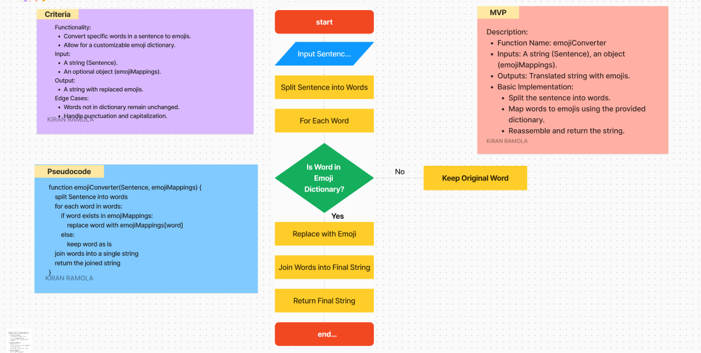

## <p align="center">Converting Text to Emojis</p>

Overview: REPLACE_ME_WITH_A_BRIEF_DESCRIPTION_OF_WHAT_YOUR_KATA_IS_ABOUT


## Overview

This guide will walk you through the process of converting text to emojis using a simple JavaScript function. The function takes a sentence and replaces specific keywords with corresponding emojis. Users can also customize the dictionary of words to emojis.

## Five Steps for Converting Text to Emojis:

### 🧮 First Step:
To convert text to emojis, you can either use the `emoji-dictionary` package or create your own object of emojis.

### 💡 Second Step:
The second step is to split the text into individual words.

### 🕵️‍♂️ Third Step:
Replace each word in the text with its corresponding emoji from the dictionary.

### 🎯 Fourth Step:
Join the words back together to form the final emoji-translated text.

### 🥇 Final Step:
Return the final emoji-translated text.

## Example Function: `emojiConverter`

This function takes a sentence and replaces certain keywords with corresponding emojis.

```javascript
/**
 * Converts words in a sentence to corresponding emojis based on a custom dictionary.
 *
 * @param {string} Sentence - The text to convert.
 * @param {Object} emojiMappings - A dictionary mapping words to emojis.
 * @returns {string} - The text with words replaced by emojis.
 */
export function emojiConverter(Sentence, emojiMappings = {}) {
    // Implementation here
}
